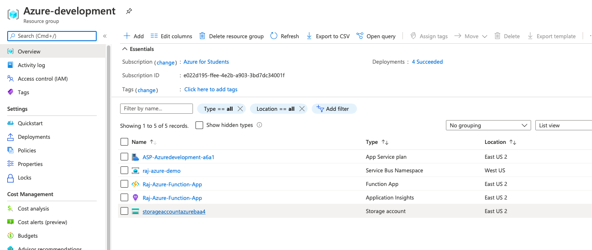
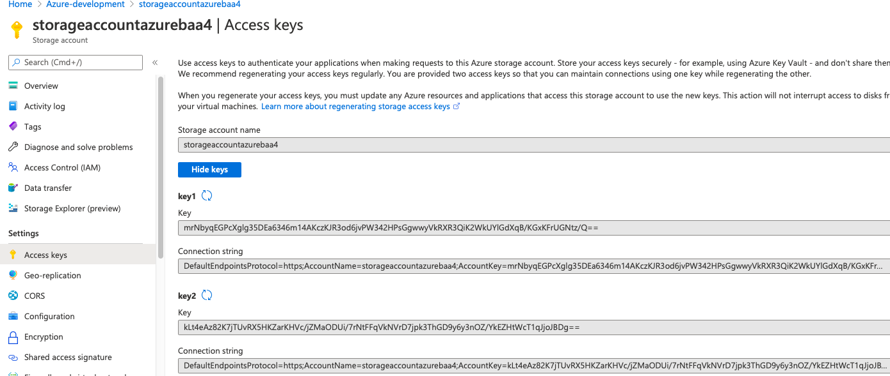
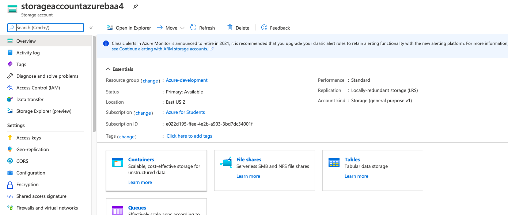
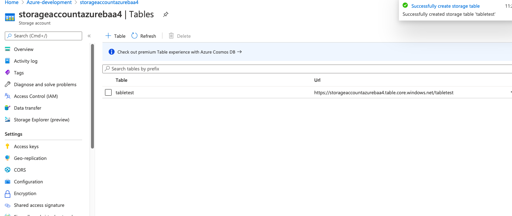
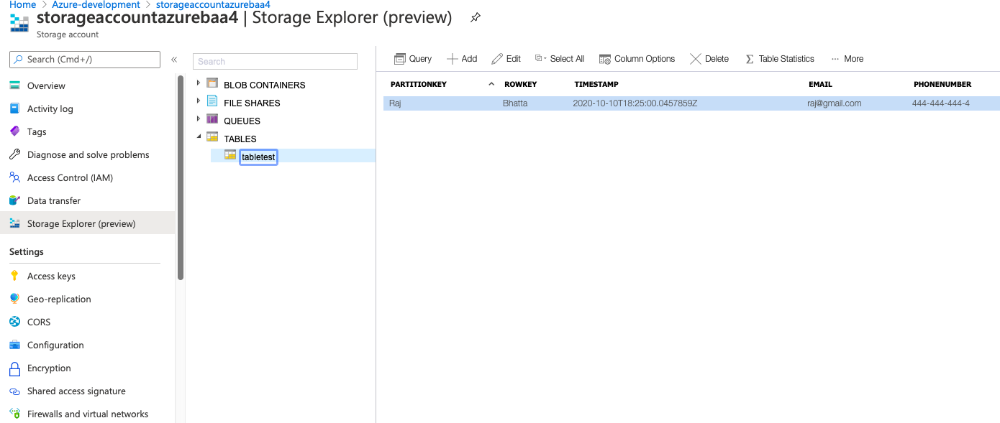

## CRUD operations using table storage ##

### 1. Add dependency ###
```java
<dependency>
            <groupId>com.microsoft.azure</groupId>
            <artifactId>azure-storage</artifactId>
            <version> 8.6.5</version>
        </dependency>
```
### 2. Creating a record inside table storage ##













### 3. Source code to create record ###
```java
package raj.azure.archieve.runner;

import com.microsoft.azure.storage.CloudStorageAccount;
import com.microsoft.azure.storage.table.CloudTable;
import com.microsoft.azure.storage.table.CloudTableClient;
import com.microsoft.azure.storage.table.TableOperation;
import raj.azure.archieve.model.CustomerEntity;

import java.net.URISyntaxException;
import java.security.InvalidKeyException;

public class CreateRecord {

    public static final String storageConnectionString="DefaultEndpointsProtocol=https;AccountName=storageaccountazurebaa4;AccountKey=mrNbyqEGPcXglg35DEa6346m14AKczKJR3od6jvPW342HPsGgwwyVkRXR3QiK2WkUYlGdXqB/KGxKFrUGNtz/Q==;EndpointSuffix=core.windows.net";

    public static void main(String[] args){

        try {

            //Retrieve storage account from connectionString
            CloudStorageAccount storageAccount=CloudStorageAccount.parse(storageConnectionString);


            //Create table client
           CloudTableClient tableClient= storageAccount.createCloudTableClient();

           //Create a cloud table object for the table, in our case it is tabletest. You must create this table inside storage account
            CloudTable cloudTable=tableClient.getTableReference("tabletest");

            //Create a new customer entity
            CustomerEntity customerEntity=new CustomerEntity("Raj","Bhatta");
            customerEntity.setEmail("raj@gmail.com");
            customerEntity.setPhoneNumber("444-444-444-4");

            //Create an operation to add the new customer to tabletest table.
           TableOperation tableOperation= TableOperation.insertOrReplace(customerEntity);


           //Submit the operation to table service
            cloudTable.execute(tableOperation);


        } catch (URISyntaxException e) {
            e.printStackTrace();
        } catch (InvalidKeyException e) {
            e.printStackTrace();
        }catch (Exception e){
            e.printStackTrace();
        }
    }
}
```

```java
package raj.azure.archieve.model;

import com.microsoft.azure.storage.table.TableServiceEntity;

public class CustomerEntity extends TableServiceEntity {
    private String email;
    private String phoneNumber;

    public CustomerEntity() {
    }

    public CustomerEntity(String firstName, String lastName) {
        this.partitionKey = firstName;
        this.rowKey = lastName;
    }

    public String getEmail() {
        return email;
    }

    public void setEmail(String email) {
        this.email = email;
    }

    public String getPhoneNumber() {
        return phoneNumber;
    }

    public void setPhoneNumber(String phoneNumber) {
        this.phoneNumber = phoneNumber;
    }
}

```